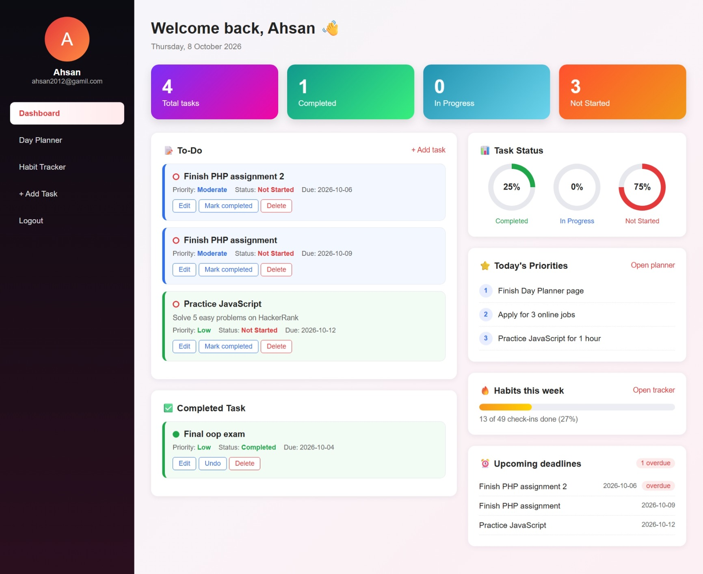
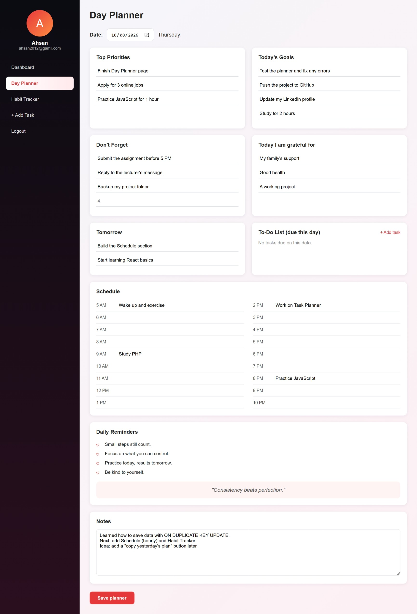
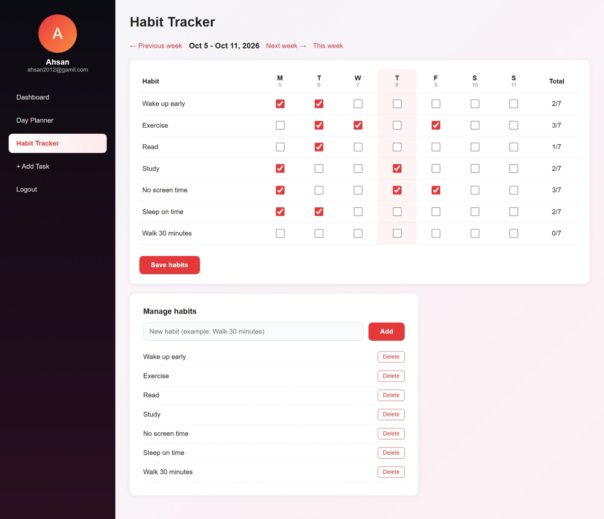
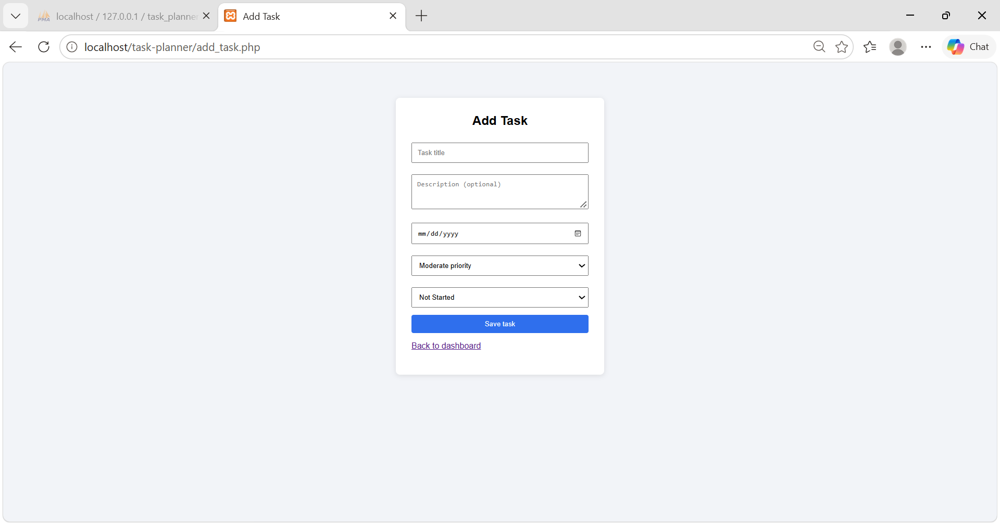
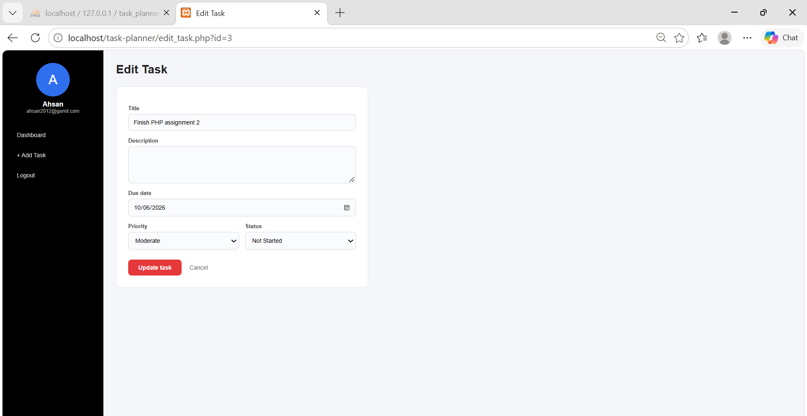
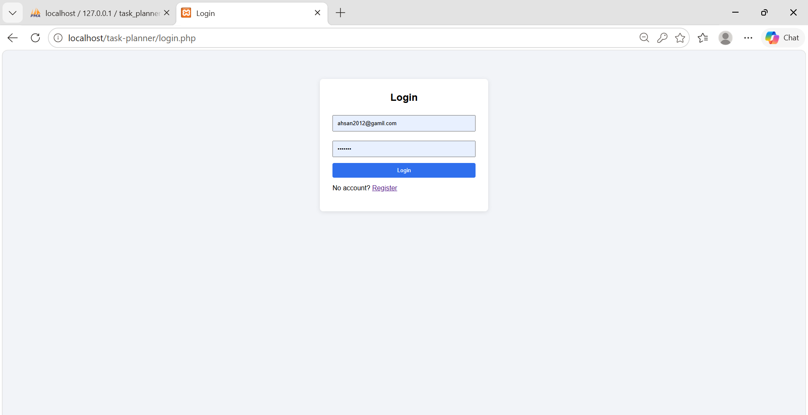
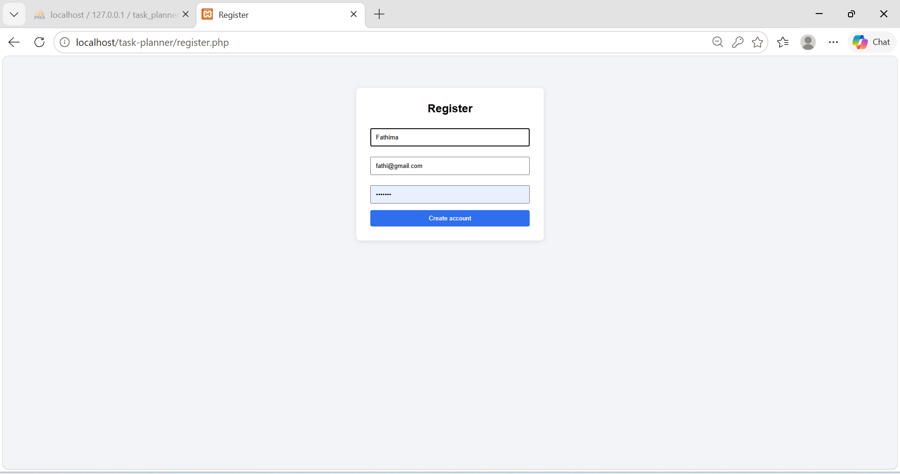

# Task Planner

A full-stack web app where users can register, log in, manage tasks, plan their day, and track weekly habits.
Built as a personal project to practice PHP, MySQL, and front-end layout.

UI inspired by "Task Manager webDesign" on Figma Community.

## Features
- User registration and login (hashed passwords, session-based access)
- Add, edit, and delete tasks with priority (Low, Moderate, Extreme) and status (Not Started, In Progress, Completed)
- Colorful dashboard with task counts, status percentages, To-Do and Completed lists
- Today's priorities, weekly habit progress, and upcoming deadlines on the dashboard
- Day Planner for each date: top priorities, goals, don't forget, grateful list, tomorrow, notes
- Hourly schedule (5 AM to 10 PM)
- Weekly Habit Tracker with custom habits and weekly totals
- Daily reminders and quotes
- Each user sees only their own data

## Technologies
- HTML, CSS (Flexbox and Grid)
- PHP (PDO, sessions)
- MySQL
- Git and GitHub
- XAMPP (local server)

## Screenshots

## How to run
1. Install XAMPP and start **Apache** and **MySQL**.
2. Copy this project folder into `C:\xampp\htdocs\`.
3. Open `http://localhost/phpmyadmin`, click **Import**, and import `database.sql`.
4. Open `http://localhost/task-planner/register.php` and create an account.

## Database
Tables: `users`, `tasks`, `plan_items`, `plan_notes`, `plan_schedule`, `habits`, `habit_logs`.
The full structure is in `database.sql`.

## What I learned
- Connecting PHP to MySQL using PDO
- Secure password handling with `password_hash()`
- Preventing SQL injection with prepared statements
- Protecting pages with sessions
- Designing relational tables with foreign keys
- Saving data per user and per date with `ON DUPLICATE KEY UPDATE`
- Building a dashboard layout with CSS Flexbox and Grid
- Changing a database structure without losing data

## Future improvements
- Login and Register pages in the same style as the dashboard
- Search and filter tasks
- Edit and reorder habits
- Rebuild the front end with React

## Author
YOUR NAME HERE - Faheema Risham
GitHub: https://github.com/Faheemarisham